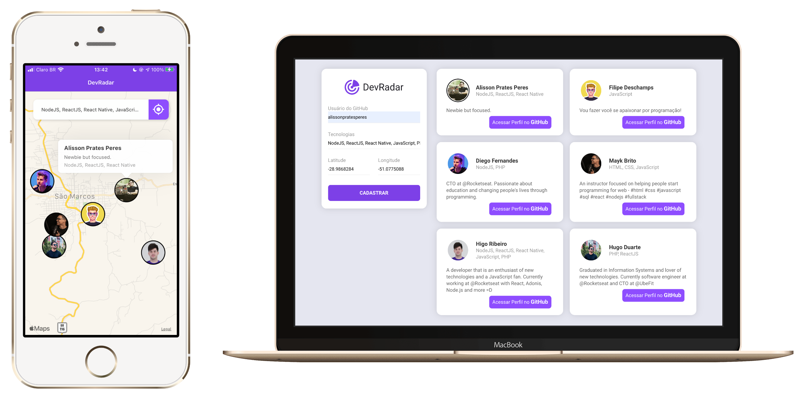

___

  

 

<a href="#dart-sobre">Sobre</a>&nbsp;&nbsp;&nbsp;|&nbsp;&nbsp;&nbsp;
<a href="#battery-tecnologias">Tecnologias</a>&nbsp;&nbsp;&nbsp;|&nbsp;&nbsp;&nbsp;
<a href="#electric_plug-execute">Execute</a>&nbsp;&nbsp;&nbsp;|&nbsp;&nbsp;&nbsp;
<a href="#fuelpump-autor">Autor</a>&nbsp;&nbsp;&nbsp;|&nbsp;&nbsp;&nbsp;
<a href="#memo-licença">Licença</a>

 

  

 

## :dart: Sobre

O **DevRadar** é um projeto que visa conectar desenvolvedores próximos a você que trabalham com as mesmas tecnologias.

## :battery: Tecnologias

Esse projeto foi desenvolvido com as seguintes tecnologias:

- <a href="https://www.npmjs.com/">Npm</a> / <a href="https://yarnpkg.com/">Yarn</a>
- <a href="https://nodejs.org/en">NodeJS</a>
- <a href="https://www.mongodb.com/">MongoDB</a>
- <a href="https://reactjs.org/">ReactJS</a>
- <a href="https://reactnative.dev/">React Native</a>
- <a href="https://expo.io/">Expo</a>

## :electric_plug: Execute

- Através do **Terminal(MacOS)** ou **Prompt de Comando(Windows)** acesse os diretórios através do comando **cd . . / cd 'diretório'**. *Abra um **terminal** por diretório pois será necessário deixar cada **stack** rodando separadamente*, para facilitar utilize o **Toggle Integrated Terminal** do VSCode;

- Execute o *BackEnd*: **cd aircnc > enter > cd backend > npm/yarn install > enter > concluído? > code .**. No *VS Code* acesse o arquivo **src/index.js** e configure a **URL da MongoDB**; Rode o *BackEnd* com o comando **npm/yarn dev**;

- Execute o *FrontEnd:* **cd . . > enter > cd frontend > npm/yarn install > enter > concluído? > code .**. No *VS Code* acesse o arquivo **src/services/api.js** e configure o **IP da API**; Rode o *FrontEnd* com o comando **npm/yarn start**;

- Execute o *Mobile:* **cd . . > enter > cd mobile > npm/yarn install > enter > concluído? > code .**. No *VS Code* acesse o arquivo **src/services/api.js** e configure o **IP da API**; Acesse o arquivo **src/services/socket.js** e configure o **IP dos WebSockets**. Rode o *Mobile* com o comando **npm/yarn start**;
## :fuelpump: Autor

- Projeto desenvolvido durante a **Semana OmniStack 10** da <a href="https://rocketseat.com.br/">Rocketseat</a>, ocorrida em **Janeiro de 2020**;

- Acesse  <a href="https://github.com/rocketseat-education/semana-omnistack-10">aqui</a> o **repositório oficial** da aplicação.

## :memo: Licença

Esse projeto está sob a **Licença MIT**. Veja o arquivo [LICENSE](https://github.com/alissonpratesperes/devradar/blob/main/LICENSE) para mais detalhes.

---

<h5 align="center">  ✍🏻&nbsp; &nbsp;na &nbsp;👋🏻&nbsp;  por <a href="https://github.com/alissonpratesperes"> Alisson Prates Peres </a> &nbsp;👨🏻‍💻 </h5>
