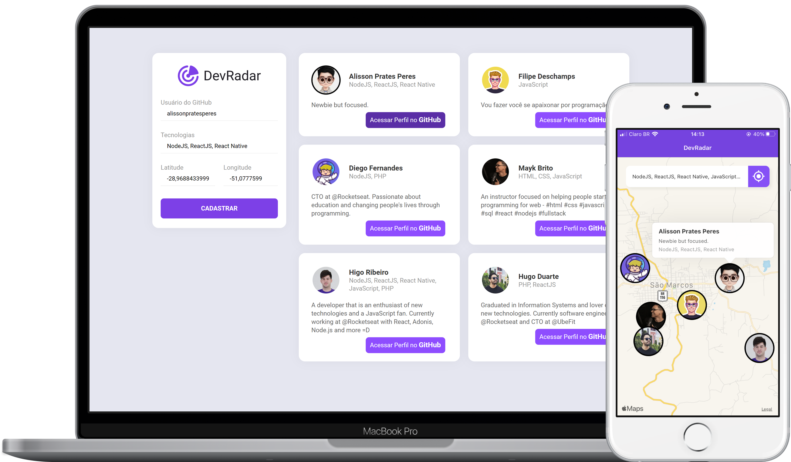



  

___

 

  <a href="#sobre">SOBRE</a>&nbsp;&nbsp;&nbsp;|&nbsp;&nbsp;&nbsp;<a href="#tecnologia">TECNOLOGIA</a>&nbsp;&nbsp;&nbsp;|&nbsp;&nbsp;&nbsp;<a href="#execute">EXECUTE</a>&nbsp;&nbsp;&nbsp;|&nbsp;&nbsp;&nbsp;<a href="#autor">AUTOR</a>&nbsp;&nbsp;&nbsp;|&nbsp;&nbsp;&nbsp;<a href="#licença">LICENÇA</a>

 

  

## SOBRE

A **devradar** é uma Aplicação que visa conectar Desenvolvedores próximos a você, e que trabalham com as mesmas tecnologias.

## TECNOLOGIA

  
<strong>Tooling</strong>

  <ul>
    <li><a href="https://insomnia.rest/">Insomnia</a></li>
    <li><a href="https://expo.dev/">Expo IO</a></li>
  </ul>

  
<strong>Database</strong>

  <ul>
    <li><a href="https://mongodb.com/">Mongo DB</a></li>
  </ul>

  
<strong>Integration</strong>

  <ul>
    <li><a href="https://socket.io/">Socket IO</a></li>
    <li><a href="https://expressjs.com/">Express</a></li>
    <li><a href="https://axios-http.com/">Axios</a></li>
  </ul>

  
<strong>Back-End</strong>

  <ul>
    <li><a href="https://nodejs.org/">Node JS</a></li>
  </ul>

  
<strong>Front-End</strong>

  <ul>
    <li><a href="https://reactjs.org/">React JS</a></li>
  </ul>

  
<strong>Mobile</strong>

  <ul>
    <li><a href="https://reactnative.dev/">React Native</a></li>
  </ul>

## EXECUTE

    - Clonar este repositório
    - Acessar o Back-End: "./backend"
        |- Instalar as dependências com o Comando: "npm install --force"
        |- Acessar o arquivo: "./backend/src/index.js:12" e verificar URL de Conexão com o Banco de Dados
            >_ Inicializar o Back-End com o Comando: "npm run dev"
    - Acessar o Front-End: "./frontend"
        |- Instalar as dependências com o Comando: "npm install --force"
        |- Acessar o arquivo: "./frontend/src/services/api.js:3" e atualizar o Endereço de Conexão do Front-End
            >_ Inicializar o Front-End com o Comando: "npm start"
    - Acessar o Mobile: "./mobile"
        |- Instalar as dependências com o Comando: "npm install --force"
        |- Acessar o arquivo: "./mobile/src/services/socket.js:3" e atualizar o Endereço de Conexão dos WebSockets
        |- Acessar o arquivo: "./mobile/src/services/api.js:3" e atualizar o Endereço de Conexão do Mobile
            >_ Inicializar o Mobile com o Comando: "expo start"

## AUTOR

Projeto desenvolvido durante a **Omni Stack Week 10** da <a href="https://rocketseat.com.br/">Rocketseat</a> ocorrida em **Janeiro de 2020**

Acesse <a href="https://github.com/rocketseat-education/semana-omnistack-10">aqui</a> o **repositório oficial** da aplicação

## LICENÇA

Esse projeto está sob a **Licença MIT** veja o arquivo [LICENSE](https://github.com/alissonpratesperes/devradar/blob/main/LICENSE) para mais detalhes

___

👨🏻‍💻&nbsp;with&nbsp;❤️
